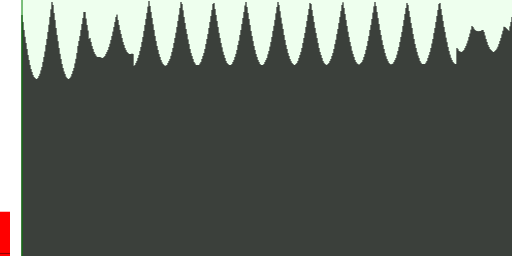
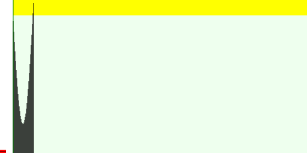
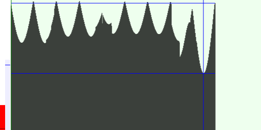

# Pitch Detector

Based on Chris Wilson's work, an improved pitch detector. The Pitch Detector calculates auto-correlation score for a range of frequencies.

See demo at http://lab.madebymark.nl/pitch-detector/example/.

## Examples

* The **Y-Axis** is the auto-correlation score. 
* The **X-Axis** is the frequency range, from high (22 
Khz) to low (83 Hz).
* The **Red bar** is the signal strength (RMS). The little dark red line is the minimal RMS.

Detect best auto-correlation of all frequencies:



Detect the first peak auto-correlation, which is the highest frequency. Auto-correlation often detects lower octaves (and harmonies), so we can just stop after the first peak. 



Detect a sudden increase in correlation: 



## Usage

* `pitchdetector.js` contains the PitchDetector (logic only)
* `pitchdetectorcanvas.js` allows you to visualize pitch detection on a canvas.
* `example/gui.js` is a playground to test and tweak the pitch detector.

Drop `pitchdetector.js` in your page, or require the CommonJS module using Webpack or Browserify.

First, create a PitchDetector:
```javascript
var detector = new PitchDetector({
	// Audio Context (Required)
	context: new AudioContext(),

	// Input AudioNode (Required)
	input: audioBufferNode, // default: Microphone input

	// Output AudioNode (Optional)
	output: AudioNode, // default: no output

	// interpolate frequency (Optional)
	//
	// Auto-correlation is calculated for different (discrete) signal periods
	// The true frequency is often in-beween two periods.
	//
	// We can interpolate (very hacky) by looking at neighbours of the best 
	// auto-correlation period and shifting the frequency a bit towards the
	// highest neighbour.
	interpolateFrequency: true // default: true

	// Callback on pitch detection (Optional)
	onDetect: function(stats, pitchDetector) { 
		stats.frequency // 440
		stats.detected // --> true
		stats.worst_correlation // 0.03 - local minimum, not global minimum!
		stats.best_correlation // 0.98
		stats.worst_period // 80
		stats.best_period // 100
		stats.time // 2.2332 - audioContext.currentTime
		stats.rms // 0.02 
	},

	// Debug Callback for visualisation (Optional)
	onDebug: function(stats, pitchDetector) { },

	// Minimal signal strength (RMS, Optional)
	minRms: 0.01,

	// Detect pitch only with minimal correlation of: (Optional)
	minCorrelation: 0.9,

	// Detect pitch only if correlation increases with at least: (Optional)
	minCorreationIncrease: 0.5,

	// Note: you cannot use minCorrelation and minCorreationIncrease
	// at the same time!
 
	// Signal Normalization (Optional)
	normalize: "rms" // or "peak". default: undefined

	// Only detect pitch once: (Optional)
	stopAfterDetection: false

	// Buffer length (Optional)
	length: 1024, // default 1024

	// Limit range (Optional):
	minNote: 69, // by MIDI note number
	maxNote: 80, 

	minFrequency: 440,    // by Frequency in Hz
	maxFrequency: 20000,

	minPeriod: 2,  // by period (i.e. actual distance of calculation in audio buffer)
	maxPeriod: 512 // --> convert to frequency: frequency = sampleRate / period

	// Start right away
	start: true // default: false
})
```

Then, start the pitch detection. It is tied to RequestAnimationFrame
```javascript
detector.start()
```

If you're done, you can stop or destroy the detector:
```javascript
detector.stop()
detector.destroy()
```

You can also query the latest detected pitch:
```javascript
detector.getFrequency() // --> 440hz
detector.getNoteNumber() // --> 69
detector.getNoteString() // --> "A4"
detector.getPeriod() // --> 100
detector.getDetune() // --> 0
detector.getCorrelation() // --> 0.95
detector.getCorrelationIncrease() // --> 0.95

// or raw data
detector.stats = {
	stats.frequency
	stats.detected
	stats.worst_correlation
	stats.best_correlation 
	stats.worst_period
	stats.best_period
	stats.rms
}
```

## Tips & Tricks

### Always use an optimization

* `minCorrelation` is the most reliable
* `minCorreationIncrease` can sometimes give better results.

### Use RMS or Peak normalization with minCorrelationIncrease

The increase in correlation strongly depends on signal volume. Therefore, normalizing using `RMS` or `Peak` can make `minCorrelationIncrease` work much better.

### Set a frequency range

If you know what you're looking or, set a frequency range. 

**Warning:** `minCorrelationIncrease` needs a large frequency range to detect a difference. The frequency range must be large enough to include both a low and high auto-correlation.

## Ideas to improve algorithm:

* Draw an "optimal" auto-correlation shape, and calculate mean squared error (MSE) from measured auto-correlation score. When MSE is low enough, a pitch is detected. (or a combination of pitches!)
* Implement DTMF demodulation as example
* Learn a shape by recording auto-correlation scores of the perfect example. The resulting shape is the average of all recordes samples. Calculate standard deviation to see if the signal can be detected reliably.

## Changelog

### 0.2.0 (26/02/2015)

* Used ScriptProcessingNode for faster analysis. Callbacks are still tied to the requestAnimationFrame.
* Extracted the Canvas draw function into a seperate file.

### 0.1.0 (25/02/2015)

* Extract core logic (pitchdetector.js) from the GUI code (example/gui.js)
* Add a new heuristic: detect a sudden increase in auto-correlation (when approaching the target frequency).
* Added signal normalization (peak or rms)
* Updated canvas visualization to draw correlation scores for every frequency.

## Contribute

I first want to check if the original author, Chris Wilson, is willing to pull my fork. So please check out the original version at https://github.com/cwilso/PitchDetect.

## Credits

Original code from [Chris Wilson](https://github.com/cwilso), improvements (see changelog) by [Mark Marijnissen](https://github.com/markmarijnissen)

## Contact
-   @markmarijnissen
-   http://www.madebymark.nl
-   info@madebymark.nl

© 2015 - Mark Marijnissen & Chris Wilson
